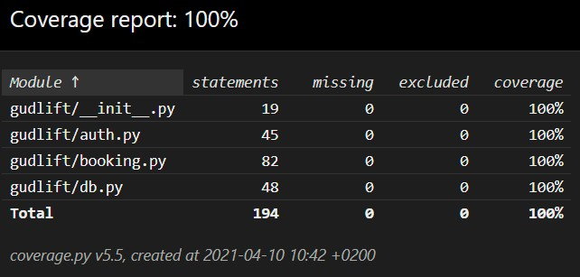
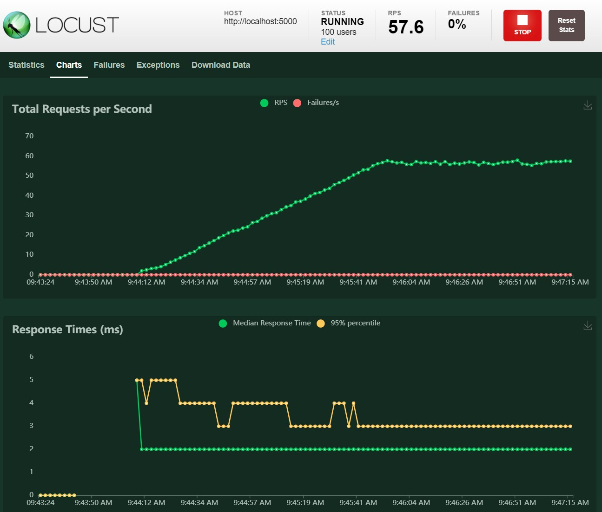

# GUDLIFT

Openclassrooms - Parcours développement Python Projet 11

## Status

This project is under development

## Description

This is a proof of concept (POC) project to show a light-weight version of a competition booking platform. The aim is the keep things as light as possible, and use feedback from the users to iterate.

This project uses the following technologies:

* [Python](https://www.python.org) as the programming language
* [Flask](https://palletsprojects.com/p/flask/) as a web framework
* [Pytest](https://pytest.org) and [Coverage](https://pypi.org/project/coverage/) for testing
* [Locust](https://locust.io) for performance monitoring

## Installation

Python 3 is required to run the API.

1. Clone this repository (or download the code using [as a zip file](https://github.com/antoine71/gudlift./archive/main.zip)):

```shell
git clone https://github.com/antoine71/gudlift.git
```

2. Navigate to the root folder of the repository.
3. Create and activate a virtual environment:

```shell
python -m venv env
source env/bin/activate
```

4. Install project dependencies:

```shell
pip install -r requirements.txt
```

5. Tell your terminal the application to work with by exporting the FLASK_APP environment variable and start the server:

```shell
$ export FLASK_APP=gudlift
```

6. Initialise the database and populate it from the json files provided using the following commands:

```shell
$ flask init-db
Initialized the database.
$ flask populate-db
Populated the database.
```

7. Run the server

```shell
$ flask run
Running on http://127.0.0.1:5000/
```

## Usage

The website can be opened from any web browser from the following address : http://localhost:5000/

## Testing

* The repo is provided with a full test suite in the folder `tests/`. This test suite provide 100% coverage. The tests can be run using the following command from the root folder of the project:

```shell
pytest
```

* A full test report can be generated in html format thanks to the utility Coverage. Coverage will create a new folder named `htmlcov`. Open the file `htmlcov/index.html`to view the report. To generate the report, from the root folder of the project, run the following commands:

```shell
coverage run --source=gudlift -m pytest
coverage html
```



## Performance testing

The performance testing is done using Locust. The file `locustfiles/locustfile.py` contains a series of requests that can be sent to the flask server to test the performance of the application.

To run locust, run the following command from the folder `locustfiles/` while the flask server is running:

```shell
locust
```

You can then open the locust application in a web browser http://localhost:8089/ and start porformance tests.



